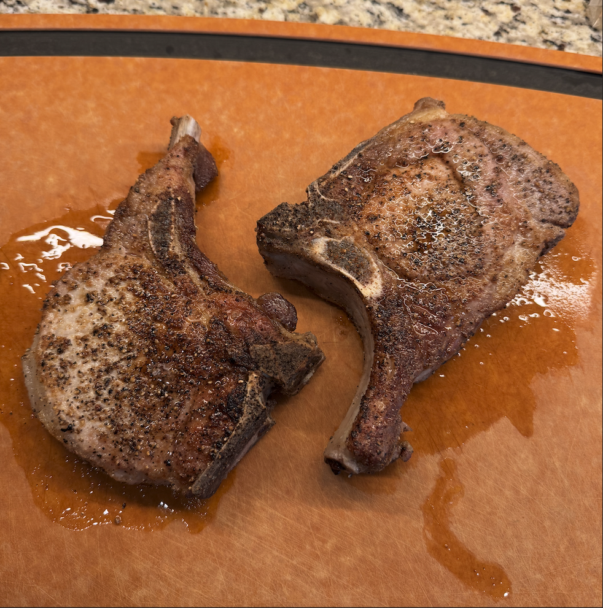

+++
date = '2025-05-11T09:28:28-04:00'
draft = false
title = 'Bone-in Pork Chop'
cuisine = 'American'
categories = ['Dinner']
method = ['Pan-Frying', 'Baking', 'Grilling']
tags = ['Juicy']
+++

## Timing

- **Prep Time:** 5 minutes
- **Cook Time:** 25 minutes
- **Total Time:** 1 hour
- **Servings:** 3

## Ingredients

- 1.5 lbs Bone-in pork chops, thick
- Kosher salt
- Black pepper
- Garlic Powder
- Onion Powder
- 2-3 Tbsp Ghee (for pan-frying)

## Instructions

1. Season the pork chops on all sides generously with the salt, pepper, garlic powder, & onion powder. Let rest for about 15 minutes.

### Pan-Frying

1. Pre heat the oven to 350°f
2. Heat a large cast iron pan on medium low on the stove top for several minutes, until it is heated thoroughly and evenly
3. Add the ghee to the pan and swirl around to coat the bottom of the pan
4. Bump the heat to medium
5. Add the seasoned pork chops to the pan and sear the first side, without moving it around, for 3 minutes
   > You can press down on the pork chops when laying them into the pan to make sure full contact with the pan is being made
6. Check the underside of one of the pork chops to see if it has a nice crust forming, if so, flip the chops over and sear the on the other side for 1 minute. If the pork is not seared on one side and doesn't have a crust yet, let it go for another minute and check again.
7. Insert a thermometer probe into the center of one of the pork chops and place the pan into the oven
8. Pull the pork chops out of the oven when the temperature reaches 135-138°f and let rest on a cutting board for 5 minutes. The internal temperature should rise another 10 degrees.
9. Slice the pork chops and serve





### Grilling

1. Pre heat the grill to 400°f
2. Add the seasoned pork chops to the grill over direct heat and sear without moving it around, for 3 minutes
3. Check the underside of one of the pork chops to see if it has a nice crust forming, if so, flip the chops over and sear the on the other side for another 3 minutes. If the pork is not seared on one side and doesn't have a crust yet, let it go for another minute and check again.
4. Move the pork chops to the top rack away from the direct heat source and insert a thermometer probe into the center of one of the pork chops
5. Pull the pork chops off the grill when the temperature reaches 135-138°f and let rest on a cutting board for 5 minutes. The internal temperature should rise another 10 degrees.
6. Slice the pork chops and serve
