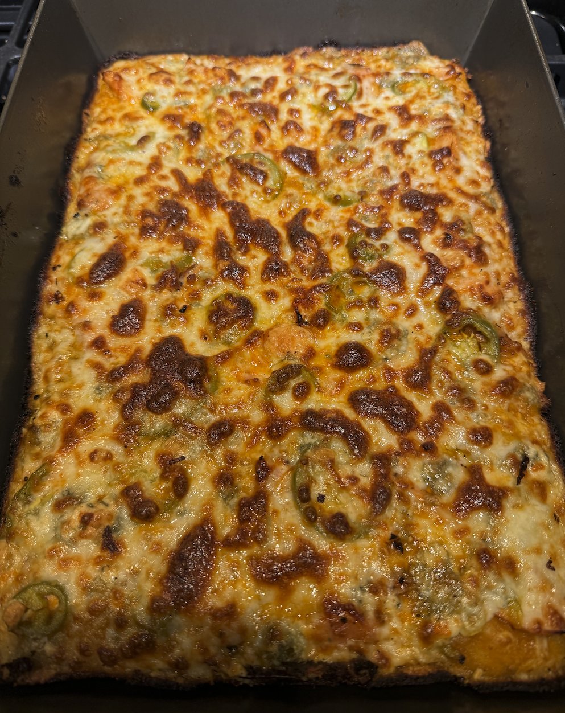
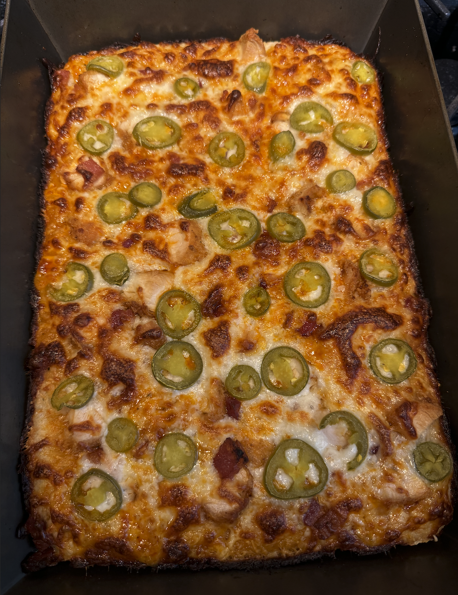
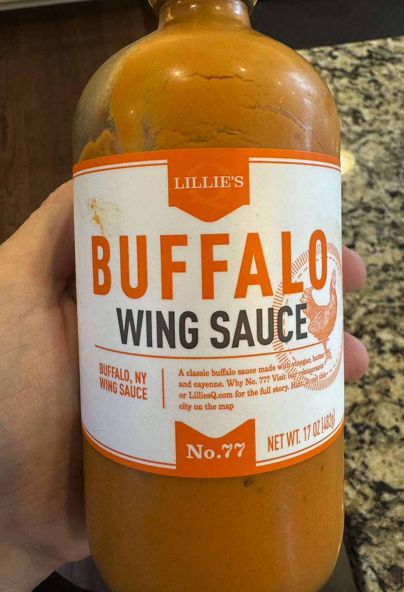

+++
date = '2025-05-19T14:32:05-04:00'
draft = false
title = 'Buffalo Chicken Pizza'
cuisine = 'American'
categories = ['Dinner']
method = 'Baking'
tags = ['Pizza', 'Pan Pizza', 'Deep Dish Pizza', 'Jalapeños', 'Buffalo', 'Spicy', 'Popcorn Chicken']
+++

## Timing

- **Prep Time:** 15 minutes
- **Cook Time:** 10 minutes
- **Total Time:** 1.5 hours
- **Servings:** 1 pizza

## Ingredients

- 1 detroit style pizza dough ([see recipe here]())
- 8-12 oz. full-fat aged mozzarella cheese, shredded
- Buffalo Wing Sauce ([Lillie's No.77](https://lilliesq.com/products/buffalo))
- Pickled jalapeño slices (drained)
- [Popcorn chicken](https://www.publix.com/pd/publix-deli-original-fried-popcorn-chicken/RIO-HC1-101298) (chopped)
- Bacon (cooked) (optional)
- Bleu cheese crumbles (optional)

## Instructions

1. Preheat the oven to 525°F convection without a pizza steel.
2. If using popcorn chicken and/or bacon, cut them into smaller more manageable bite size.
3. Spread the buffalo sauce evenly over the dough, being careful not to get it on the edge where the dough and pan meet.
4. Distribute the chicken and jalapeños (and bacon if using) evenly on top of the pizza.
5. Distribute the mozzarella cheese evenly on top of the pizza, making sure to go edge to edge with the shredded mozzarella.
6. Slide assembled pizza into the preheated oven.
7. Bake for about 10 minutes until the cheese is bubbly and golden brown.
8. Remove the pizza from the pan and slide out onto a cooling tray.
9. Slice and serve. (If using bleu cheese, crumble on top of pizza before serving)

## Notes/Tips

You can use any pizza dough recipe or type for this, it doesn't have to be the detroit style pan pizza




