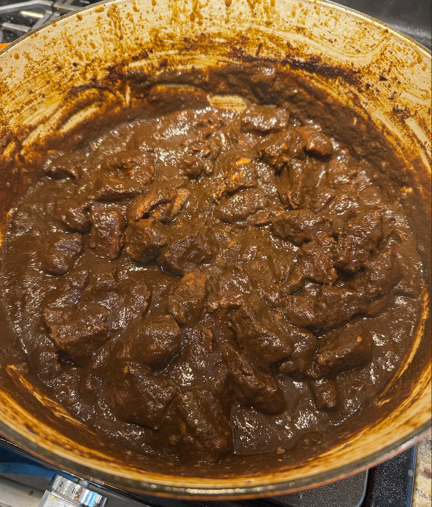
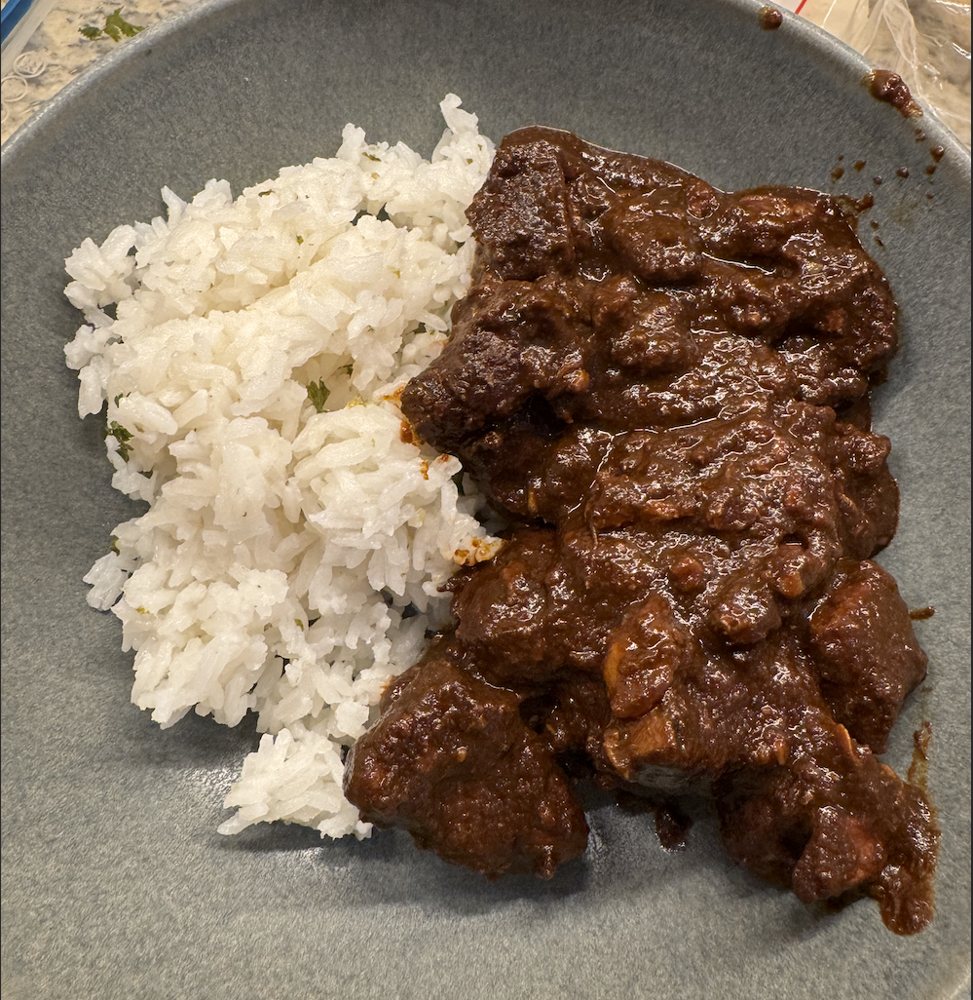
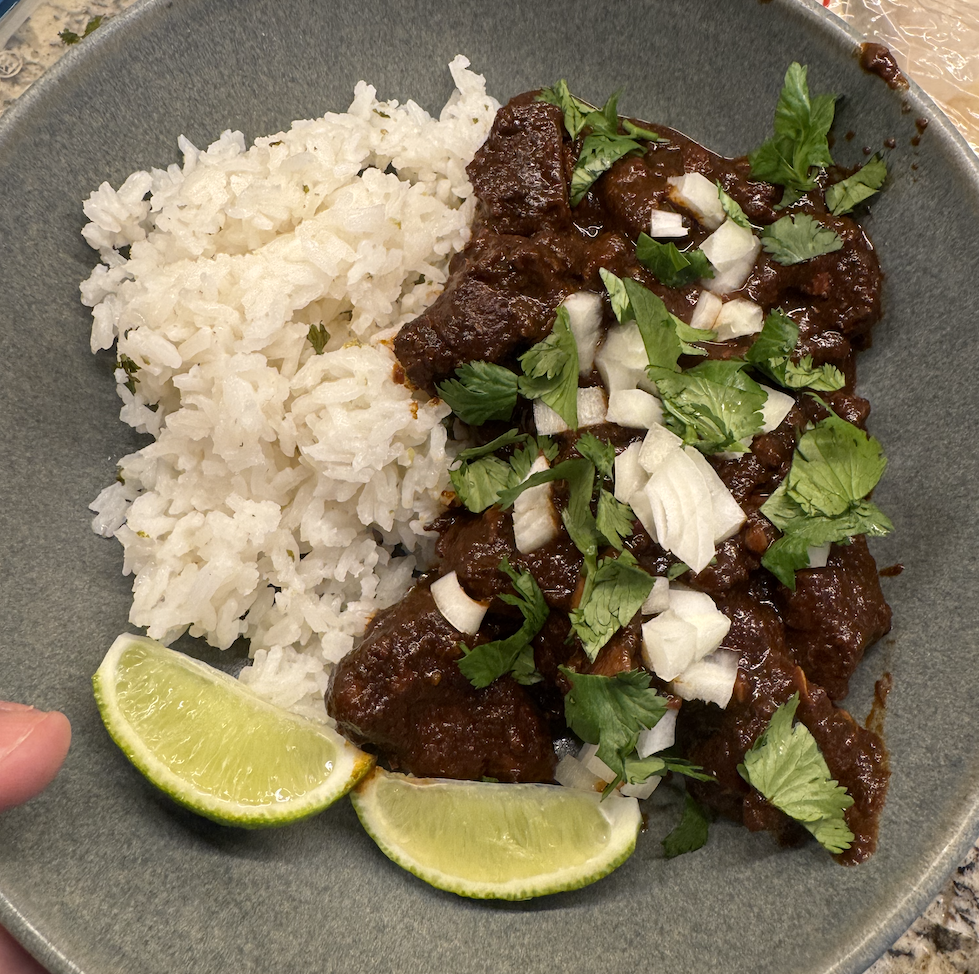

+++
date = '2025-05-09T13:38:33-04:00'
draft = false
title = 'Chili Colorado'
cuisine = 'Mexican'
categories = ['Dinner']
method = 'Braising'
tags = ['Pork', 'Chili']
+++

## Timing

- **Prep Time:** 1 hour
- **Cook Time:** 3 hours
- **Total Time:** 4 hours
- **Servings:** 16

## Ingredients

- 2.5 lbs of boneless pork shoulder/butt
- 5-8 Ancho peppers (dried)
- 2-3 Passilla peppers (dried)
- 3-4 Guajillo peppers (dried)
- 7 cups of chicken stock, separated (2 cups & 5 cups)
- 6 cloves of garlic
- 1 Tbsp ground cumin
- 2 Tbsp Mexican oregano
- 2 Tbsp fresh sage
- 2 Bay leaves
- 3 tsp Kosher salt
- 1 tsp Fresh cracked black pepper

## Instructions

1. Remove the stem and seeds from the peppers, cut them up in manageable pieces and place into a heat proof bowl
2. Heat 2 cups of chicken stock to a simmer and pour over the dried chilies. Cover with a lid and lest steep for 30 minutes to rehydrate and soften up
3. While the peppers are soaking, peel the garlic and roughly chop the fresh sage
4. Cut the pork should into roughly 1 inch cubes, season with salt and pepper and set aside
5. After the peppers are rehydrated and soft, add them and the liquid to a blender along with the garlic, oregano, sage, and cumin. Blend until smooth, roughly 2-5 minutes.
6. Heat a large dutch oven over medium high heat and add 1-2 Tbsp of vegetable oil to lightly coat the pan. Wait until hot before adding the chopped pork in batches, being careful not to overcrowd the pan. Get a good sear on a few sides before removing from the heat and searing another batch of the cubed meat.
7. Once all the meat is seared, add the rest of the meat and the juices in the dutch oven along with the rest of the chicken stock, bay leaves, and chili puree
8. Mix everything well and bring to a boil, then reduce the heat to low and let simmer lightly for 2-3 hours uncovered
   > Be sure to stir the pot frequently to reduce the chance of anything sticking to the bottom of the pot
9. Once the pork is tender and the sauce is thickened to your liking, remove from the heat and serve
   > If the pork is not done cooking but the sauce is too thick, you can add a splash of water or chicken stock to loosen it back up

## Notes/Tips

You can serve this with warm flour tortillas and/or rice

## Source



https://www.bonappetit.com/recipes/article/groat-ricks-chili-colorado




