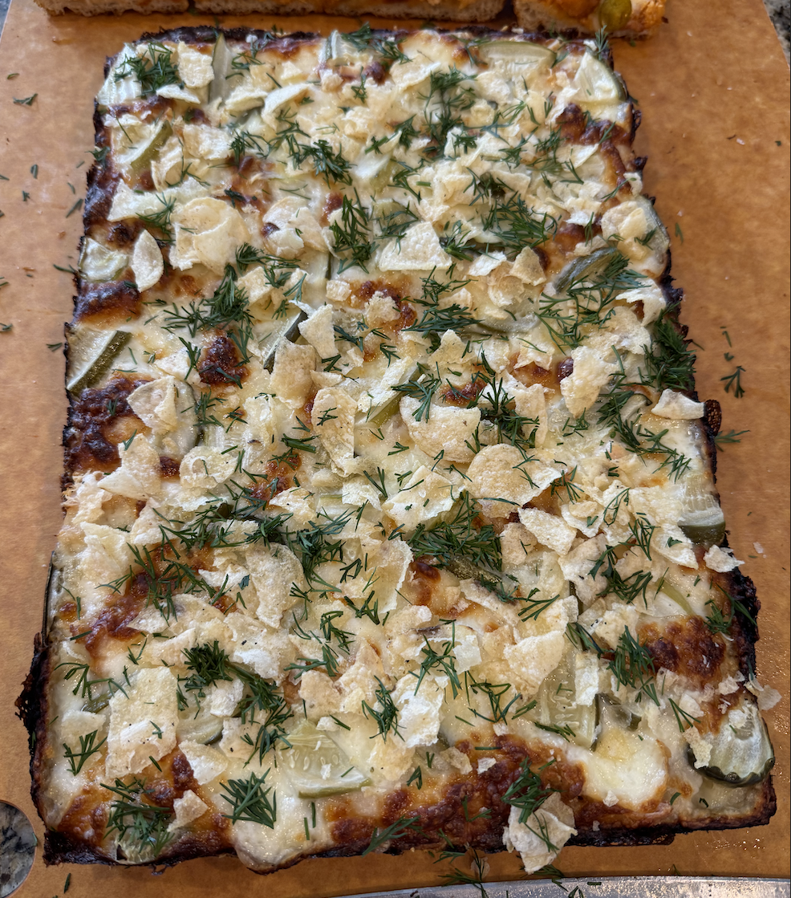

+++
date = '2025-05-06T09:44:51-04:00'
draft = false
title = 'Pickle Pizza'
cuisine = 'American'
categories = ['Dinner']
method = 'Baking'
tags = ['Pizza', 'Pan Pizza', 'Deep Dish Pizza', 'Pickles']
+++

## Timing

- **Prep Time:** 15 minutes
- **Cook Time:** 10 minutes
- **Total Time:** 1.5 hours
- **Servings:** 1 pizza

## Ingredients

- 1 detroit style pizza dough ([see recipe here]())
- 4 oz. Mozzarella pearls
- 8 oz. full-fat aged mozzarella cheese, shredded
- 2 Tbsp Parmesan Reggiano, grated
- 2 Tbsp Pecorino Romano, grated
- Sliced or sandwich style pickles (Claussen Kosher Dill)
- 1 Tbsp Fresh dill, finely chopped (dried will also work)
- Ranch dressing
- Ranch dressing powder
- Plain kettle chips
- Popcorn chicken (optional)

## Instructions

1. Preheat the oven to 525°F convection without a pizza steel.
2. Remove the excess moisture from the pickle slices and mozzarella pearls by pressing them between paper towels.
3. Cut the pickle slices into a more manageable bite size.
4. If using popcorn chicken, cut them in half for a more manageable bite size.
5. Spread the ranch dressing as the sauce evenly over the dough, being careful not to get it on the edge where the dough and pan meet.
6. Distribute the parmesan and pecorino cheeses evenly on top of the pizza.
7. Distribute the mozzarella cheeses evenly on top of the pizza, making sure to go edge to edge with the shredded mozzarella.
8. Distribute the pickles (and chicken) evenly on top of the pizza.
9. Slide assembled pizza into the preheated oven.
10. Bake for about 10 minutes until the cheese is bubbly and golden brown.
11. Remove the pizza from the pan and slide out onto a cooling tray.
12. Sprinkle some ranch powder, dill, and crushed kettle chips over top the pizza.
13. Slice and serve.

## Notes/Tips

You can use any pizza dough recipe or type for this, it doesn't have to be the detroit style pan pizza




